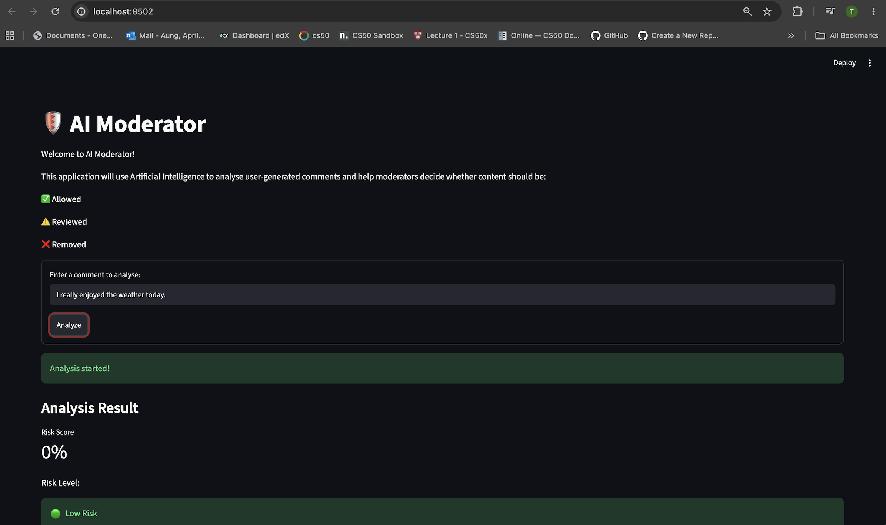
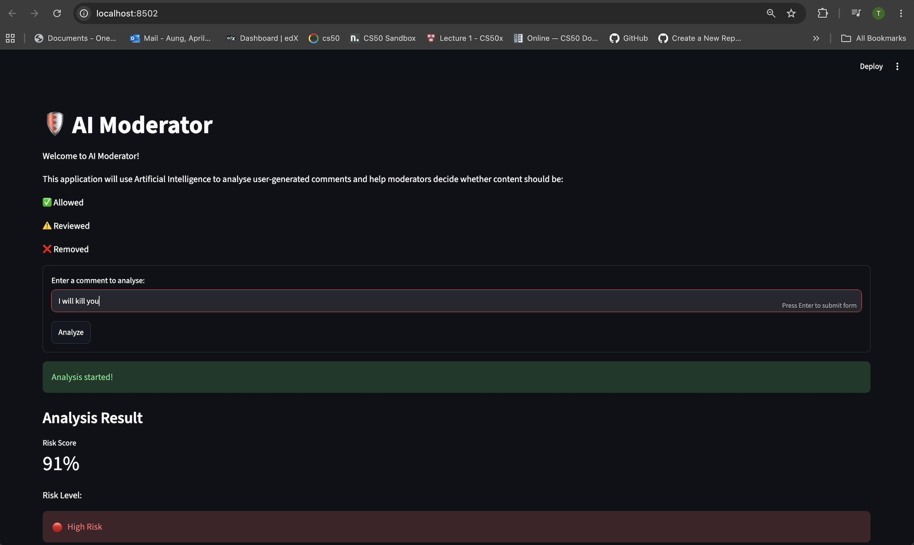
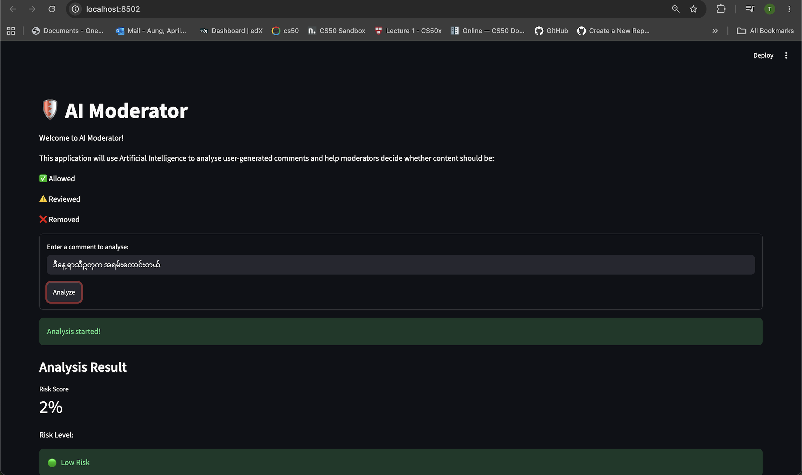

# 🛡️ AI Content Moderator

An AI-powered multilingual content moderation application built with **Python, Hugging Face Transformers, PyTorch, and Streamlit**.

The application analyzes user-generated comments in **English and Burmese** and provides a risk assessment to help identify potentially harmful content.

## 📸 Application Demo

### Safe Content


### Harmful Content


### Burmese Content


## 🚀 Features

- English and Burmese text moderation
- AI-powered toxicity detection
- Risk score calculation
- Low, Medium, and High risk levels
- Allow, Review, and Remove moderation decisions
- Category-level toxicity scores
- Interactive Streamlit interface
- Burmese moderation dataset preparation
- Burmese model experimentation using XLM-RoBERTa
- Model evaluation using accuracy, precision, recall, and F1 score
- Error analysis including false positives and false negatives

## 🧠 Main Model

The main application uses the Hugging Face:

`unitary/toxic-bert`

The model is integrated into the Streamlit application to analyze text and generate toxicity scores.

The project also includes a separate experimental Burmese moderation pipeline using **XLM-RoBERTa** and a curated Burmese moderation dataset.

## 📊 Burmese Model Evaluation

The experimental Burmese moderation model V2 was evaluated on a balanced test set containing **132 examples**.

| Metric | Result |
|---|---:|
| Test examples | 132 |
| Accuracy | 96.97% |
| Precision | 98.44% |
| Recall | 95.45% |
| F1 Score | 96.92% |
| Correct predictions | 128 |
| Incorrect predictions | 4 |

The evaluation also identified **1 false positive and 3 false negatives**, which were analyzed separately to understand model limitations.

> These results represent the Burmese V2 experimental test set and should not be interpreted as the overall accuracy of the production application.

## 🏗️ Project Architecture

```text
User Comment
     │
     ▼
Streamlit Interface
     │
     ▼
Toxicity Classification Model
     │
     ▼
Risk Score Calculation
     │
     ├── Low Risk
     ├── Medium Risk
     └── High Risk
     │
     ▼
Moderation Decision
     │
     ├── ✅ Allow
     ├── ⚠️ Review
     └── ❌ Remove

